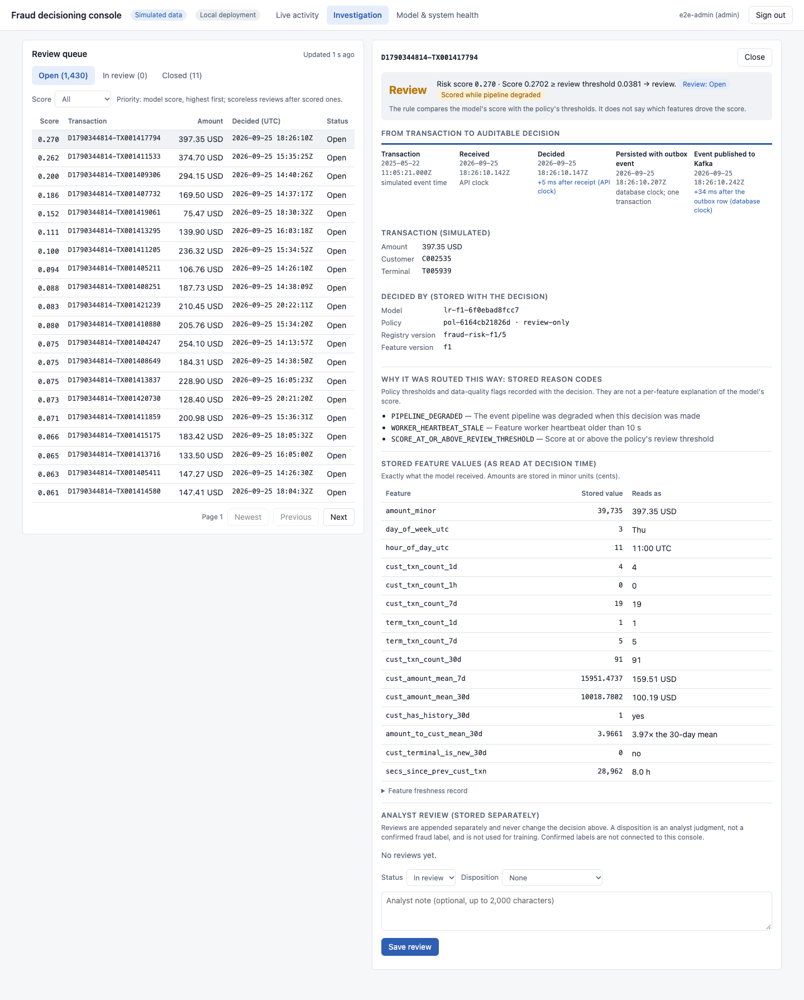
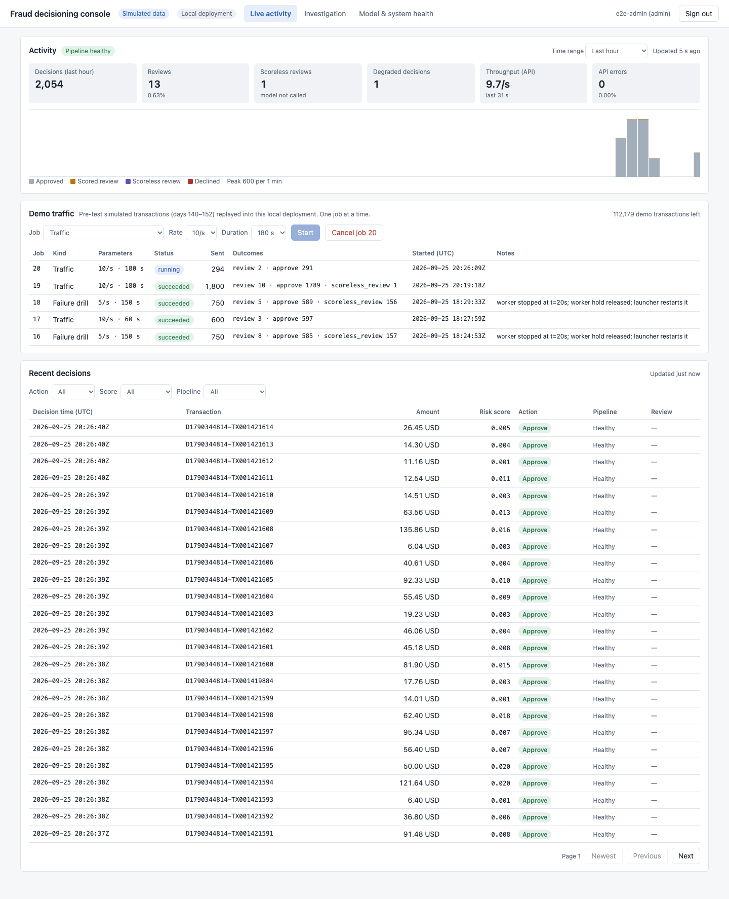
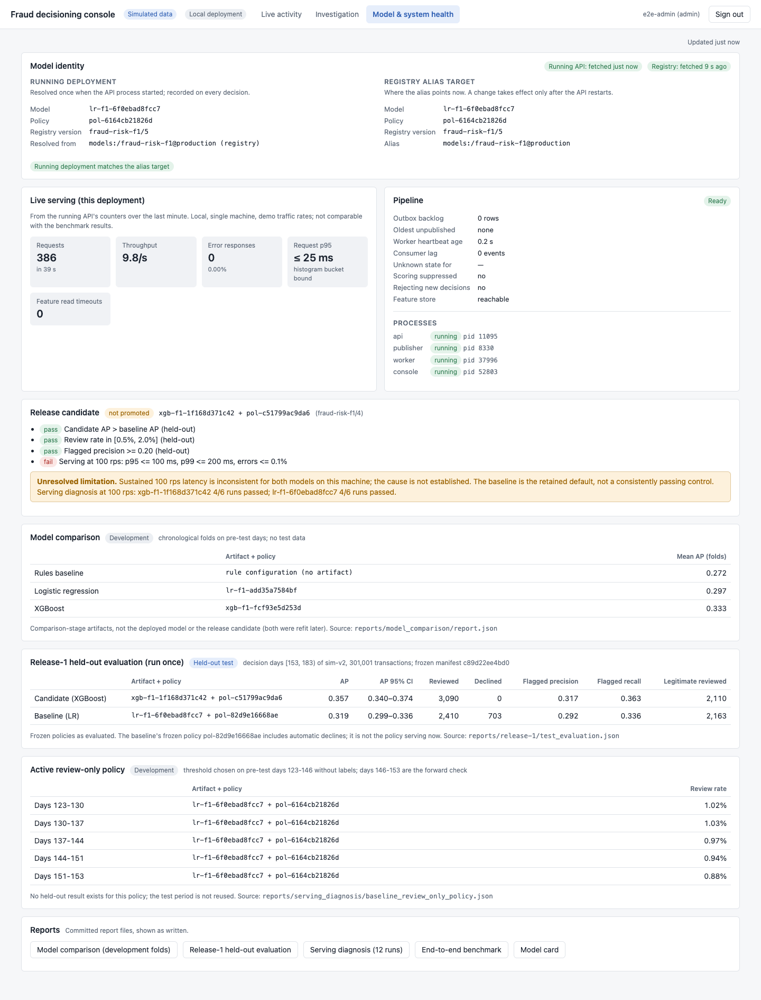
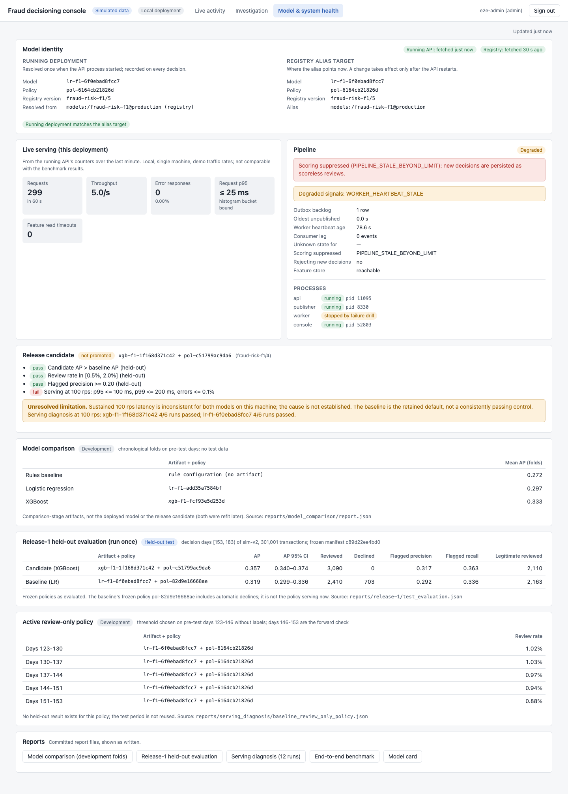

# Fraud decisioning platform

A **locally deployed, production-oriented fraud decisioning platform on synthetic payment
data**. Transactions are scored in real time by a versioned model and policy, stored as
auditable decisions, fed back into point-in-time features through Kafka, and worked by analysts
in a React console. A portfolio project; everything runs on one laptop at no cost.



<sub>Investigation view of a real decision from the local deployment. More:
[live activity](docs/screenshots/02-live-activity.png) ·
[failure drill](docs/screenshots/11-drill-scoring-suppressed.png) ·
[model and system health](docs/screenshots/07-health.png) ·
[demo script](docs/DEMO_SCRIPT.md)</sub>

## What I engineered

* **Point-in-time correct features.** A feature is visible only if its event had *arrived*
  before the decision; Redis (Lua) and in-memory implementations are parity-tested over 20
  random event streams, and offline training rebuilds the same features.
* **Durable, idempotent decisions.** One decision per transaction id, enforced by the database;
  the decision and its outbox event commit together; retries return the stored decision and
  conflicting retries get 409 (concurrency races tested).
* **Duplicate-safe streaming with tested recovery.** At-least-once Kafka delivery with
  idempotent feature application; crashes, Redis outages and a stopped worker are tested; after
  60 s of staleness the API stops scoring and stores scoreless reviews instead.
* **Versioned model and policy deployment.** Model + policy bundles in an MLflow registry,
  resolved once at startup; every decision records model, policy and registry version;
  promotion and rollback demonstrated with restarts.
* **An honest release decision.** A frozen, once-only held-out evaluation; the better-ranking
  XGBoost candidate was **not promoted** because it did not reproducibly meet the pre-declared
  latency criterion.
* **A usable analyst console.** Authenticated React/TypeScript UI with live activity, an
  append-only review workflow that never alters decisions, and a health view showing the
  running model next to the registry target.

## Measured results (synthetic data, one Apple M1 laptop)

| Result | Context |
|---|---|
| Held-out AP **0.357** (XGBoost candidate) vs **0.319** (LR baseline), non-overlapping 95% CIs | 301,001 held-out transactions, evaluated once. The candidate is **not promoted**. The **active** release is the LR baseline with a **review-only policy that has no held-out result** (development review rate 0.88–1.03%). [report](reports/release-1/test_evaluation.md) |
| Failure drill: worker stopped 90 s → **157 of 750** decisions stored as scoreless reviews, **0** HTTP errors, automatic recovery | Real thresholds, 5 transactions/s. [walkthrough](reports/dashboard/walkthrough.json) |
| **2,220** demo requests → **2,220** new decisions, **0** dead-lettered events, including a SIGKILLed worker and cancelled jobs | Repeatability check on a clean setup. [report](reports/dashboard/repeatability.json) |
| 100 rps with p95 12.1 ms in one benchmark run, **but only 4 of 6** sustained runs per model met the latency criterion | Latency on this machine is **inconsistent**; cause not established. [diagnosis](reports/serving_diagnosis/summary.md) |

## Launch in brief

Needs Docker (Colima or Docker Desktop), uv, Python ≥ 3.13 and Node ≥ 22.12, about 3 GB of
free memory for the containers, and about 2.5 GB of disk for images and dependencies. Full
instructions, timings and reset/stop commands are in [Running it](#running-it).

```bash
make env install up migrate data-v2   # one-time: dependencies, services, schema, synthetic data
make mlflow                           # in its own terminal
make setup dashboard-build            # register the committed model + policy; build the UI
make dashboard-user NAME=<you> ROLE=admin
make dashboard                        # open http://127.0.0.1:8200
```

## Limitations

* **Synthetic data only**; nothing here is evidence about real payments or real savings.
* Both models essentially **miss scenario 2** (compromised terminals, ~60% of simulated fraud;
  recall ≈ 0.01). Calibration is not evaluated.
* **Sustained latency is inconsistent** on this machine; the project does not claim reliable
  100 rps.
* Local deployment only (single machine, one API process, local HTTP, in-memory console
  sessions); remote CI is configured but **not yet executed**.
* Analyst dispositions are not labels and are not used for training; confirmed labels are not
  connected to the console. Full list: [docs/RELEASE_CHECKLIST.md](docs/RELEASE_CHECKLIST.md).

## Architecture

```text
            ┌──────────── analyst console (React, :8200) ──── session cookie ───┐
            │                                                                   ▼
 client ──▶ FastAPI scoring API ──▶ Redis features (Lua snapshot) ──▶ model + policy
            │   └─ BEGIN; decision + outbox row; COMMIT ──▶ PostgreSQL ◀── console BFF (read,
            │                                                   │         append-only reviews)
            │                    publisher ◀──── outbox ────────┘
            │                        │
            │                        ▼
            │                     Kafka ──▶ feature worker ──▶ Redis (point-in-time state)
            └─ model/policy bundle resolved once at startup from MLflow `@production`
```

* **Decisions:** idempotent on `transaction_id` (database-enforced), each persisted with its
  outbox event in one transaction, its feature values, reason codes, and the exact model, policy
  and registry version ([DESIGN §2, §7, §10](docs/DESIGN.md)).
* **Features:** arrival-time semantics; Redis and in-memory implementations are parity-tested;
  degraded pipeline states either flag decisions or, past 60 s, stop scoring and persist
  scoreless reviews ([§4, §8, §9](docs/DESIGN.md)).
* **Console:** a local backend-for-frontend holds the API key server-side; analysts sign in with
  a session cookie; reviews are append-only and never change decisions ([§11](docs/DESIGN.md),
  [ADR 0011](docs/adr/0011-analyst-console-backend-for-frontend.md)).

## Running it

**Prerequisites:** Docker (Colima or Docker Desktop; on Colima the checkout must be under your
home directory so the database init scripts are visible to the VM), [uv](https://docs.astral.sh/uv/),
Python ≥ 3.13 (developed on 3.14.0), Node ≥ 22.12, and free local ports 5433, 6380, 9094, 5050,
8110 and 8200 (all configurable in `.env`). About 3 GB of memory for the containers.

**What a fresh clone lacks:** the dataset, trained artifacts, registry contents and accounts are
not in git. The *serving* bundle (LR model `lr-f1-6f0ebad8fcc7` + review-only policy
`pol-6164cb21826d`, 5.5 KB of integrity-checked JSON) is committed under
[`releases/active/`](releases/active/), so serving needs **no training**. The dataset is
regenerated deterministically (identical content hashes).

### One-time setup

```bash
make env                      # create .env from .env.example (local-only values; edit if you like)
make install up migrate       # Python deps, PostgreSQL/Redis/Kafka containers, schema
make data-v2                  # generate the simulated dataset (sim-v2, 1.8M transactions)
make mlflow                   # MLflow server — leave running in its own terminal
make setup                    # register releases/active by identity; alias production -> it
make dashboard-build          # install and build the React dashboard
make dashboard-user NAME=<you> ROLE=admin   # your console account; prompts for a password (≥ 12 chars)
```

`make setup` reuses an already registered version holding the same model and policy (tags and
file hashes) or registers a new one; the version number is whatever the registry assigns.
Running it again changes nothing. Accounts are stored as scrypt hashes in
`run/dashboard/analysts.json` (git-ignored); `ROLE=analyst` accounts can review but cannot run
demo jobs. Re-running `dashboard-user` with the same name replaces that account's password.

Measured from a clean `git clone` with isolated services (separate Compose project and ports,
empty database, Redis and MLflow registry, no artifacts or accounts) on an Apple M1:

| Step | Time | Notes |
|---|---|---|
| `make install` | 5 s | empty uv cache; ~790 MB of Python packages downloaded (fast network) |
| `npm ci` (inside `dashboard-build`) | 1–4 s | empty npm cache; ~26 MB of packages |
| `make up` | 7 s | Docker images already present; pulling them cold is ~1.2 GB extra |
| `make migrate`, `make data-v2` | 4 s, 14 s | dataset regenerated with identical content hashes |
| `make mlflow` ready, `make setup` | 16 s, 17 s | first registration creates the MLflow experiment |
| first `make dashboard` ready | 45 s | includes the one-time Redis bootstrap (~150 MB) |

Download times depend on your network; everything else is local. Keep the machine awake during
demonstrations (for example `caffeinate -i make dashboard` on macOS): system sleep pauses the
worker and distorts the failure drill's timing.
Retraining is optional (`make train`, see [Reproducing artifacts](#reproducing-artifacts)).

### Start and stop

```bash
make up                       # if the containers are not running
make mlflow                   # in its own terminal, if not running
make dashboard                # API :8110, publisher, worker, console :8200
```

Open http://127.0.0.1:8200 and sign in. **Stop** with Ctrl-C in the `make dashboard` terminal
(stops all four processes), Ctrl-C for MLflow, and `make down` for the containers (data volumes
are kept).

**Memory.** Redis is capped at 384 MB with no eviction, by design: feature state must never be
dropped silently. The dashboard namespace uses roughly 150–180 MB after bootstrap and grows
slowly with demo traffic; other demos (`make demo-c`,
`make demo-pipeline`) share the same instance. If Redis fills up, the worker's writes fail, the
pipeline goes degraded and then scoreless; `make dashboard-reset` reclaims the namespace.

**Restart behaviour.** `make dashboard` reuses its deployment namespace and demo position:
decisions, reviews and job history persist in PostgreSQL, and Redis feature state persists while
the Redis container runs. Redis is not persisted to disk, so after `make down`/`up` the launcher
refuses to start on the old namespace and asks for `make dashboard-reset`. The API resolves the
`production` alias only at startup: after changing the alias, restart `make dashboard`. The
launcher restarts a crashed child process (at most 5 times in 5 minutes).

### Demonstrate

In the console as an admin: *Live activity → Demo traffic* runs pre-test simulated transactions
(days 140–152) at a chosen rate; *Failure drill* stops the feature worker for 90 s and restarts
it. Script: [docs/DEMO_SCRIPT.md](docs/DEMO_SCRIPT.md). Each job takes the next unused slice of
the demo transactions, so repeated runs create new decisions rather than idempotent retries.
Other demonstrations (independent of the dashboard): `make demo-c`, `make demo-pipeline`,
`make demo-registry` (promotion and rollback in the registry — afterwards run `make setup` again
to point `production` back at the active bundle), `make bench-e2e`.

### Reset (destructive for demo state)

```bash
make dashboard-reset          # stop `make dashboard` first
```

Deletes the current dashboard namespace's Redis keys, Kafka topics and consumer group, then
starts a fresh namespace. Earlier decisions, reviews and job records stay in PostgreSQL as an
audit trail but are no longer shown. Nothing outside that namespace is touched. `make down` keeps
volumes; removing them (`docker compose down -v`) deletes all local data.

### Tests

```bash
make check                    # ruff, mypy --strict, unit tests, isolated integration tests
make test-integration         # integration tests only, on disposable services
make test-services-down       # stop and discard those services
make dashboard-test           # dashboard type check and component tests
```

Integration tests never touch the application's services. `make test-integration` starts a
separate Compose project (`docker-compose.test.yml`, project `fraud-itest`, ports 5543, 6480 and
9394, database in memory) and runs the tests against it. Before any destructive step (migrating
down, truncating, flushing, deleting topics, pausing a container) a guard in `tests/safety.py`
refuses targets that are the application's database, Redis or Kafka, or on the same server, and
the Redis-outage tests pause only a container named explicitly in `FRAUD_TEST_REDIS_CONTAINER`
that publishes the test Redis port.

Browser walkthrough (running stack and an admin account; every check is an assertion and failures
keep evidence in `run/e2e-evidence/`):
`cd dashboard && E2E_USER=<you> E2E_PASSWORD=<password> node e2e/walkthrough.mjs`. Demo
repeatability: `E2E_USER=… E2E_PASSWORD=… uv run python scripts/verify_demo_repeatability.py`.
Privacy check (reports file locations and categories, never the matched text; personal terms come
from a local file outside the repository): `uv run python scripts/privacy_check.py`.

### Reproducing artifacts

Serving does not need training. `make train` rebuilds pre-test features and retrains the LR
model and its frozen policy: 115 s on the clean copy above. The retrained model had identical
coefficients and preprocessing to `lr-f1-6f0ebad8fcc7`, but a different identity
(`lr-f1-9f923283e2c6`) because artifact identities include the recorded code revision (the
copy was not a git checkout). Re-deriving the review-only policy likewise gives the same
threshold under a new policy version. The committed files in `releases/active/` are therefore
the reference for the active identities. `make compare` reproduces the model comparison (needs
MLflow).

## All measured results

Simulated data; one Apple M1 laptop; see each source for conditions.

| What | Result | Source |
|---|---|---|
| Model comparison (development folds, pre-test) | mean AP: rules 0.272, LR 0.297, XGBoost 0.333 | [report](reports/model_comparison/report.md) |
| Held-out evaluation, run once (301,001 txns) | XGBoost `xgb-f1-1f168d371c42` AP 0.357 (95% CI 0.340–0.374) vs LR `lr-f1-6f0ebad8fcc7` 0.319 (0.299–0.336); candidate review rate 1.03%, precision 0.317, recall 0.363 | [report](reports/release-1/test_evaluation.md) |
| Active review-only policy `pol-6164cb21826d` | development review rates 0.88–1.03% by week; **no held-out result** | [json](reports/serving_diagnosis/baseline_review_only_policy.json) |
| End-to-end benchmark (one run, 2026-09-24, LR + frozen policy) | 100 rps: 6,000/6,000 scored, p50 7.2 ms, p95 12.1 ms, p99 17.7 ms; decision → feature applied p95 87 ms. **Not reproduced consistently:** see the next row | [report](reports/benchmarks/e2e.md) |
| Serving diagnosis (12 runs at 100 rps) | criterion met in 4/6 runs for each model; cause of failures not established | [summary](reports/serving_diagnosis/summary.md) |
| Dashboard failure drill (worker stopped 90 s at 5/s) | 750 decisions: 157 scoreless reviews, 0 HTTP errors; worker restarted automatically | [walkthrough](reports/dashboard/walkthrough.json) |
| Dashboard polling (one tab, live view) | 44 console requests/min; mean console response 9–46 ms per endpoint | [walkthrough](reports/dashboard/walkthrough.json) |

## Screenshots

| Live activity | Investigation |
|---|---|
|  |  |
| **Model & system health** | **Failure drill: scoring suppressed** |
|  |  |

All screenshots: [docs/screenshots/](docs/screenshots/). Demo: [docs/DEMO_SCRIPT.md](docs/DEMO_SCRIPT.md).

Design: [docs/DESIGN.md](docs/DESIGN.md) · Data: [docs/DATASET_CARD.md](docs/DATASET_CARD.md) · Model: [docs/MODEL_CARD.md](docs/MODEL_CARD.md) · Decisions: [docs/adr/](docs/adr/) · Progress: [docs/PROGRESS.md](docs/PROGRESS.md)

## License and provenance

The original code and documentation are under the [MIT license](LICENSE). The transaction
simulator was written for this project after reading the prose description of the generative
process in Le Borgne et al., *Reproducible Machine Learning for Credit Card Fraud Detection —
Practical Handbook* (2022); it adapts that design and the example's parameter values, with
attribution. What was consulted, what was adapted and what was written independently are listed
in [THIRD_PARTY_NOTICES.md](THIRD_PARTY_NOTICES.md). Dependencies keep their own licenses.
